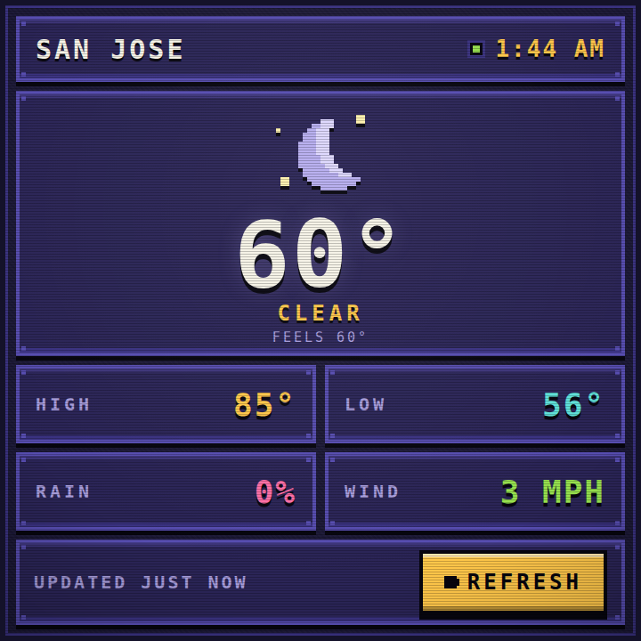

# piPulseDashboard

A Game Boy Advance-inspired weather dashboard for a **720 × 720 HyperPixel Square Touch**
display on a Raspberry Pi 5.

It does one thing: show the current weather for San Jose, California in a pixel-art
handheld-console interface, full-screen, with no scrolling.



## Getting started

```bash
git clone https://github.com/juliofuentesUI/piPulseDashboard.git
cd piPulseDashboard
npm install
npm run dev
```

Then open **http://localhost:5173**.

> `npm run dev` starts two processes: the Fastify API on port **3000** and the Vite dev
> server on port **5173**. The dashboard is on **5173**. Port 3000 only answers under
> `/api`, so visiting `http://localhost:3000/` directly returns a 404 — that is correct.

The dev server binds to `0.0.0.0`, so you can also open the dashboard from another
machine on the same network at `http://<pi-ip>:5173`.

## Scripts

Run from the repository root:

| Command | What it does |
| --- | --- |
| `npm run dev` | Fastify API + Vite dev server, concurrently |
| `npm run build` | Compiles the API to `dist/` and bundles the web app |
| `npm run start` | Serves the built output (API + `vite preview`) |
| `npm run typecheck` | `tsc --noEmit` for the API, `svelte-check` for the web app |

## Kiosk mode on the Pi

Once `npm run dev` (or `npm run start`) is running, launch Chromium full-screen:

```bash
chromium --kiosk http://localhost:5173
```

- `chromium` — launches the Chromium browser.
- `--kiosk` — opens the page full-screen with no tabs, address bar, or other browser
  chrome, and blocks the usual ways of leaving the page. Exit with `Alt+F4`.
- `http://localhost:5173` — the locally running Svelte application.

Startup is **not** automated yet. When you are ready for that, a `systemd --user`
service or an entry in `~/.config/autostart/` is the usual next step.

On some Raspberry Pi OS images the binary is named `chromium-browser` instead of
`chromium`.

## Project layout

```
piPulseDashboard/
├── apps/
│   ├── api/                      Fastify service
│   │   ├── src/
│   │   │   ├── server.ts         routes, error handling, shutdown
│   │   │   ├── weather.ts        Open-Meteo fetch, validation, normalisation
│   │   │   ├── cache.ts          5-minute TTL cache, coalescing, stale-on-error
│   │   │   ├── config.ts         environment-driven config
│   │   │   └── types.ts          upstream types vs. our API contract
│   │   ├── package.json
│   │   └── tsconfig.json
│   └── web/                      Svelte 5 + Vite front end
│       ├── src/
│       │   ├── App.svelte        720×720 shell, scaling, CRT overlay
│       │   ├── app.css           palette, reset, shared panel frame
│       │   ├── main.ts
│       │   └── lib/
│       │       ├── api.ts        typed client for /api/weather
│       │       ├── dashboard.svelte.ts   state, timers, refresh policy
│       │       ├── types.ts      transport types vs. view types
│       │       ├── view.ts       snapshot → view model, time formatting
│       │       ├── components/   StatusBar, HeroPanel, StatGrid, FooterBar, …
│       │       └── weather-icons/  eight original pixel-art sprites
│       ├── index.html
│       ├── package.json
│       ├── svelte.config.js
│       ├── tsconfig.json
│       └── vite.config.ts
├── package.json                  npm workspaces + scripts
├── .env.example
└── .gitignore
```

## API

### `GET /api/weather`

```json
{
  "location": "San Jose",
  "temperature": 72,
  "apparentTemperature": 71,
  "condition": "CLEAR",
  "conditionKey": "clear",
  "weatherCode": 0,
  "isDay": true,
  "high": 84,
  "low": 61,
  "precipitationProbability": 5,
  "windSpeed": 8,
  "updatedAt": "2026-07-30T01:00:00-07:00"
}
```

Temperatures are whole degrees Fahrenheit, wind is MPH, precipitation probability is a
percentage. `conditionKey` and `isDay` are what the client uses to pick a sprite;
`weatherCode` is the raw WMO code, kept so the client can get smarter without an API
change.

Response headers include `x-cache: fresh | revalidated | stale` and `age`.

### `GET /api/health`

Liveness plus the configured location and cache TTL.

### Behaviour

- Data comes from [Open-Meteo](https://open-meteo.com/), which needs **no API key**.
- Responses are cached in memory for **5 minutes**. Concurrent misses share a single
  upstream request.
- If Open-Meteo fails but a previous response is cached, that response is served with
  `x-cache: stale` rather than an error. Only a cold cache plus a failure returns `503`.
- All third-party API logic stays in the Fastify app. The Svelte app only ever calls the
  relative path `/api/weather`; Vite proxies it in both `dev` and `preview`, so no port
  is hardcoded in the client.

## Configuration

Every value has a working default, so a `.env` file is optional. Copy `.env.example` to
`.env` at the repository root to change any of them — both apps read from that one file.

| Variable | Default | Purpose |
| --- | --- | --- |
| `PORT` | `3000` | Fastify port |
| `HOST` | `0.0.0.0` | Fastify bind address |
| `WEB_PORT` | `5173` | Vite dev/preview port |
| `WEATHER_LOCATION_NAME` | `San Jose` | Name shown in the status bar |
| `WEATHER_LATITUDE` | `37.3382` | |
| `WEATHER_LONGITUDE` | `-121.8863` | |
| `WEATHER_TIMEZONE` | `America/Los_Angeles` | |
| `WEATHER_CACHE_TTL_MS` | `300000` | Cache lifetime (5 minutes) |
| `WEATHER_REQUEST_TIMEOUT_MS` | `8000` | Upstream request timeout |

## Front-end behaviour

- Shows a styled loading screen, then fetches `/api/weather`.
- Auto-refreshes every **10 minutes**; the clock ticks on the wall-clock minute.
- A large touch-friendly **REFRESH** button forces a fetch.
- A failed refresh **never blanks the screen**. The last good reading stays up and the
  footer shows what went wrong. The full-screen error state only appears when there has
  never been a successful load.
- Distinct states for loading, successful refresh, API failure, and no network. Losing
  and regaining the network is detected via `online`/`offline` events, and regaining it
  triggers an immediate refresh.

## Design notes

- Original pixel art only — no Nintendo logos, game graphics, or Game Boy Advance
  branding.
- Sprites are generated from a small rect-based helper (`lib/weather-icons/sprite.ts`)
  and rendered as SVG with `shape-rendering="crispEdges"`, so every edge lands on a whole
  pixel at any scale.
- The layout is authored at a fixed 720 × 720 and scaled with a single transform, so it
  is pixel-exact on the HyperPixel and never reflows or produces a scrollbar on a
  desktop browser.
- Animations are limited to `transform` and `opacity` on a handful of elements, with
  long durations, to stay light on the Pi. All of them are disabled under
  `prefers-reduced-motion: reduce`. The scanline and vignette overlays are static.
- No webfont is bundled, so the type falls back to the sharpest monospace available.
  To go fully pixel, drop a `.woff2` into `apps/web/public/fonts/` and add a matching
  `@font-face` named `Pixel Operator` — the font stack in `app.css` already looks for it.

## Requirements

- Node.js 20 or newer (developed on 24).
- No database, no Docker, no API key.
